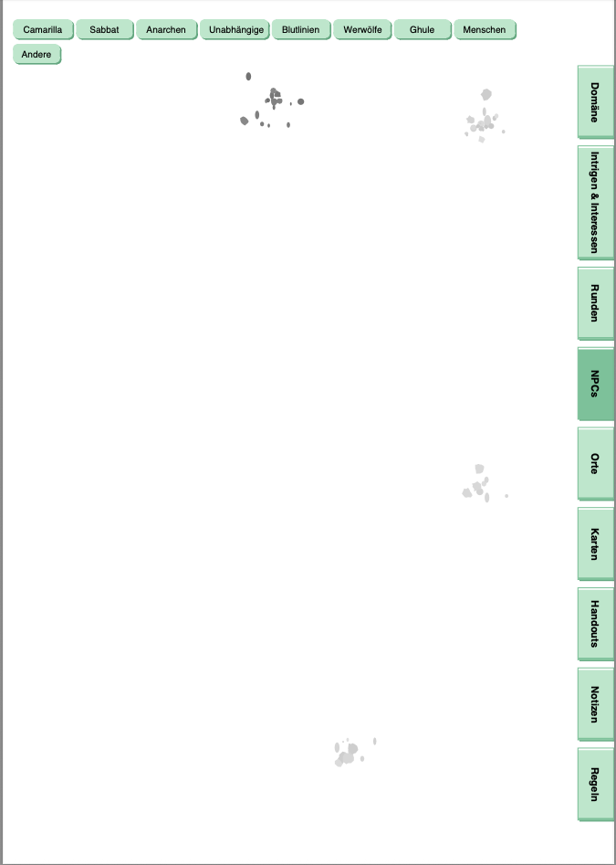

<a name="readme-top"></a>

<!-- Top Links Bar -->

[![LinkedIn][linkedin-shield]][linkedin-url]
[![Instagram][instagram-shield]][instagram-url]

<!-- PROJECT LOGO -->
<br />

<div align="center">
  
  <h1 align="center">Character Journal Generator</h1>

  <p align="center">
    Generate dynamic PDF journals with interactive navigation for character journals
    <br />
    <a href="https://github.com/foxnoir/pen_and_paper_generators"><strong>Explore the project »</strong></a>
    <br />
  </p>
</div>

<details>
  <summary>Table of Contents</summary>
  <ol>
    <li>
      <a href="#about-the-project">About The Project</a>
    </li>
    <li>
      <a href="#features">Features</a>
    </li>
    <li>
      <a href="#installation">Installation</a>
      <ul>
        <li><a href="#requirements">Requirements</a></li>
      </ul>
    </li>
    <li>
      <a href="#usage">Usage</a>
      <ul>
        <li><a href="#basic-usage">Basic Usage</a></li>
        <li><a href="#configuration">Configuration</a></li>
        <li><a href="#customizing-tabs">Customizing Tabs</a></li>
      </ul>
    </li>
    <li>
      <a href="#file-structure">File Structure</a>
    </li>
    <li>
      <a href="#technical-details">Technical Details</a>
    </li>
    <li>
      <a href="#customization">Customization</a>
    </li>
    <li>
      <a href="#troubleshooting">Troubleshooting</a>
    </li>
  </ol>
</details>

## About The Project

The Character Journal Generator creates dynamic PDF journals with interactive navigation tabs and customizable content structure. Perfect for players who want professional-looking character journals with easy navigation.



> **Note:** This is part of the [Pen and Paper Generators](../README.md) project. For an overview of all available generators, see the main [README](../README.md).

**Key Features:**
- Dynamic PDF generation from JSON structure
- Interactive navigation (right-side vertical tabs and top-left horizontal tabs)
- Customizable tab structure (tabs, subsections, sub-subsections)
- Modern design with jade green color scheme
- Hyperlink support for easy navigation

<p align="right"><a href="#readme-top">back to top</a></p>

## Features

- **Dynamic PDF Generation**: Creates a fully interactive PDF journal from JSON structure
- **Interactive Navigation**: Right-side vertical tabs and top-left horizontal tabs for easy navigation
- **Customizable Structure**: Define tabs, subsections, and sub-subsections via JSON configuration
- **Modern Design**: Rounded tabs with shadows, jade green color scheme, and professional layout
- **Hyperlink Support**: All tabs are clickable and navigate to their respective pages

<p align="right"><a href="#readme-top">back to top</a></p>

## Installation

**Important:** If you're using a virtual environment (`.venv`), install the packages there!

### Requirements

- Python 3.7+
- PyMuPDF>=1.23.0

Install dependencies:
```bash
cd character_journal_generator
pip install -r requirements.txt

# Or in virtual environment:
.venv/bin/pip install -r requirements.txt
```

<p align="right"><a href="#readme-top">back to top</a></p>

## Usage

### Basic Usage

Run the generator:
```bash
cd character_journal_generator
python3 journal_generator.py
```

This will:
- Load the structure from `tab_structure.json`
- Generate `character_journal.pdf` with all tabs and content
- Extract font styling from `character_journal.pdf` (if available)

### Configuration

The journal structure is defined in `tab_structure.json`. This file contains:

- **Right-side tabs**: Vertical navigation tabs along the right edge
- **Upper tabs**: Horizontal navigation tabs in the top-left corner
- **Subsections**: Nested navigation structure for each main tab
- **Metadata**: Page dimensions, tab positions, and styling options

#### JSON Structure

The JSON file follows this structure:

```json
{
    "right_tabs": [
        {
            "name": "Tab Name",
            "target_page": 1,
            "y_position": 65.0,
            "height": 70.0,
            "subsections_left_top_tabs": [
                {
                    "name": "Subsection Name",
                    "seconnd_subsections_left_tabs": ["Sub-subsection 1", "Sub-subsection 2"],
                    "keywords": ["Keyword 1", "Keyword 2"],
                    "sub_subsections": ["Alternative sub-subsection 1"]
                }
            ],
            "seconnd_subsections_left_tabs": ["Direct sub-subsection"]
        }
    ],
    "upper_tabs": [
        {
            "name": "Tab Name",
            "target_page": 1
        }
    ],
    "metadata": {
        "page_width": 595.2755737304688,
        "page_height": 841.8897705078125,
        "tab_width": 35.0,
        "right_tab_x_position": 560.2755737304688,
        "upper_tabs_position": {
            "x": 10.0,
            "y": 20.0
        }
    }
}
```

### JSON Logic and Field Reference

#### Right-Side Tabs (`right_tabs`)

Each right-side tab object can contain:

- **`name`** (required): Tab label displayed vertically (rotated 90° counter-clockwise)
- **`target_page`** (optional): Target page number for the tab (auto-calculated if not specified)
- **`y_position`** (optional): Vertical position from top in points (auto-calculated if not specified)
- **`height`** (optional): Tab height in points (auto-calculated based on name length if not specified)
  - Default calculation: >20 chars = 110.0, >15 chars = 85.0, else = 70.0
- **`subsections_left_top_tabs`** (optional): Array of subsection objects that appear as upper tabs
- **`seconnd_subsections_left_tabs`** (optional): Array of strings for direct sub-subsections (if no subsections)

#### Subsections (`subsections_left_top_tabs`)

Each subsection object can contain:

- **`name`** (required): Subsection label displayed horizontally in the first row
- **`seconnd_subsections_left_tabs`** (optional): Array of strings for sub-subsections displayed in the second row
- **`sub_subsections`** (optional): Alternative field name for sub-subsections (used by "Regeln" tab)
- **`keywords`** (optional): Array of strings for keyword-based page detection (currently not used for tab generation)

**Note:** The generator checks both `seconnd_subsections_left_tabs` and `sub_subsections` fields, using whichever is present.

#### Page Generation Logic

Pages are generated dynamically based on the JSON structure:

1. **Main tab page**: First page for each right tab (the `target_page`)
2. **Subsection pages**: One page per subsection
3. **Sub-subsection pages**: One page per sub-subsection

The page structure follows this pattern:
- Page 1: Main tab page
- Page 2: First subsection page
- Page 3+: Sub-subsection pages for first subsection
- Page N: Next subsection page
- And so on...

#### Metadata (`metadata`)

- **`page_width`**: Page width in points (default: 595.28 for A4)
- **`page_height`**: Page height in points (default: 841.89 for A4)
- **`tab_width`**: Width of right-side tabs in points (default: 35.0)
- **`right_tab_x_position`**: X position of right-side tabs (default: calculated from page width)
- **`upper_tabs_position`**: Object with `x` and `y` positions for upper-left tabs
  - `x`: Horizontal position from left edge (default: 10.0)
  - `y`: Vertical position from top (default: 20.0)

### Customizing Tabs

**Right-side tabs** are defined in `right_tabs`:
- `name`: Tab label (displayed vertically, rotated 90° counter-clockwise)
- `y_position`: Vertical position from top (in points)
- `height`: Tab height (auto-calculated if not specified)
- `subsections_left_top_tabs`: Array of subsections that appear as upper tabs

**Upper tabs** (subsections) are defined within each right tab:
- `name`: Subsection label (displayed horizontally)
- `seconnd_subsections_left_tabs`: Array of sub-subsections (appear in second row)
- `sub_subsections`: Alternative field name for sub-subsections (used by "Regeln" tab)

### Output

The generator creates `character_journal.pdf` with:
- All pages dynamically generated from JSON structure
- Interactive navigation tabs (right-side and top-left)
- Proper hyperlinks between pages

<p align="right"><a href="#readme-top">back to top</a></p>

## File Structure

```
character_journal_generator/
├── journal_generator.py       # Main generator script
├── layout_generator.py       # Handles visual layout (tabs)
├── content_processor.py      # Handles content extraction and processing
├── tab_structure.json        # JSON configuration file
├── character_journal.pdf     # Source PDF (optional, for font styling)
├── character_journal.pdf     # Generated output
└── requirements.txt          # Python dependencies
```

<p align="right"><a href="#readme-top">back to top</a></p>

## Technical Details

- **PDF Library**: PyMuPDF (fitz)
- **Page Format**: A4 (595.28 x 841.89 points)
- **Tab Colors**: Jade green scheme (customizable in `layout_generator.py`)
- **Language**: Python 3.7+
- **Output Format**: PDF
- **Platform**: Cross-platform (macOS, Linux, Windows)

<p align="right"><a href="#readme-top">back to top</a></p>

## Customization

### Tab Colors

Edit `layout_generator.py` to change tab colors:
```python
self.tab_colors = {
    "background": (0.75, 0.90, 0.80),  # Light jade green (inactive)
    "active": (0.50, 0.75, 0.60),      # Dark jade green (active)
    "border": (0.50, 0.75, 0.60),      # Border color
    "shadow": (0.40, 0.65, 0.50)      # Shadow color
}
```

<p align="right"><a href="#readme-top">back to top</a></p>

## Troubleshooting

**Issue**: Tabs are cut off or overlapping
- **Solution**: Adjust `max_width` in `layout_generator.py` or reduce tab spacing

**Issue**: Text not visible in tabs
- **Solution**: Check font initialization in `create_empty_pages()` method

**Issue**: PDF generation fails
- **Solution**: Ensure `tab_structure.json` is valid JSON and all required fields are present

<p align="right"><a href="#readme-top">back to top</a></p>

## License

See [LICENSE](../LICENSE) file for details.

<p align="right"><a href="#readme-top">back to top</a></p>

[license-shield]: https://img.shields.io/github/license/othneildrew/Best-README-Template.svg?style=for-the-badge
[license-url]: https://github.com/othneildrew/Best-README-Template/blob/master/LICENSE.txt
[linkedin-shield]: https://img.shields.io/badge/-LinkedIn-black.svg?style=for-the-badge&logo=linkedin&colorB=555
[linkedin-url]: https://www.linkedin.com/in/tanja-polz-5636401a5/
[twitter-shield]: https://img.shields.io/badge/Twitter-%231DA1F2.svg?style=for-the-badge&logo=Twitter&logoColor=white
[twitter-url]: https://twitter.com/_foxnoir_?lang=de
[instagram-shield]: https://img.shields.io/badge/Instagram-%23E4405F.svg?style=for-the-badge&logo=Instagram&logoColor=white
[instagram-url]: https://www.instagram.com/codeincouture/
