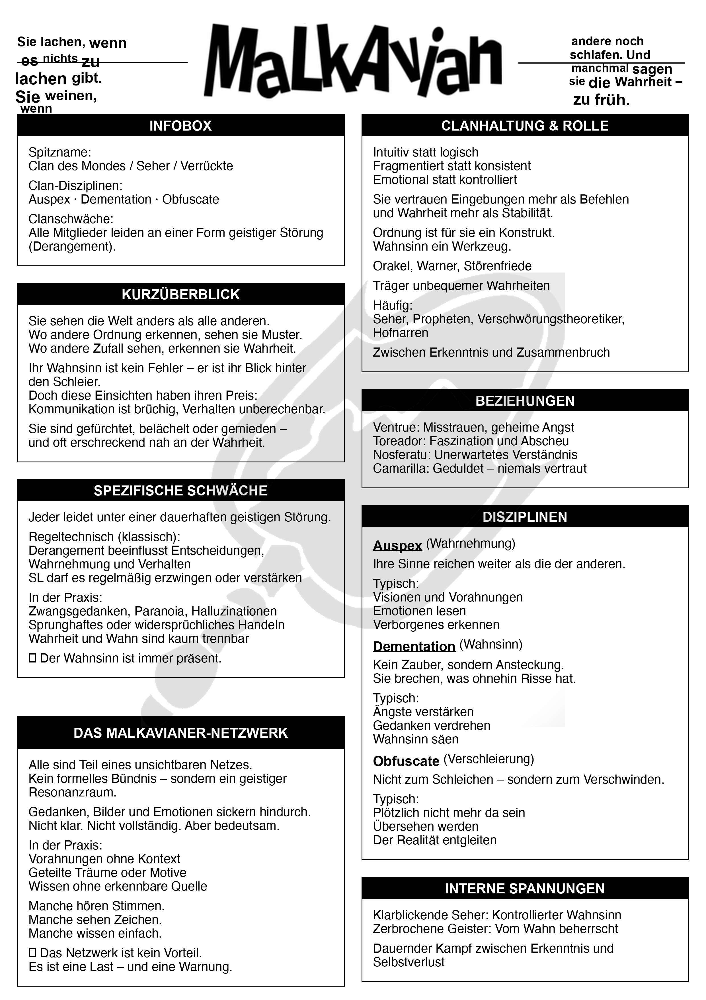
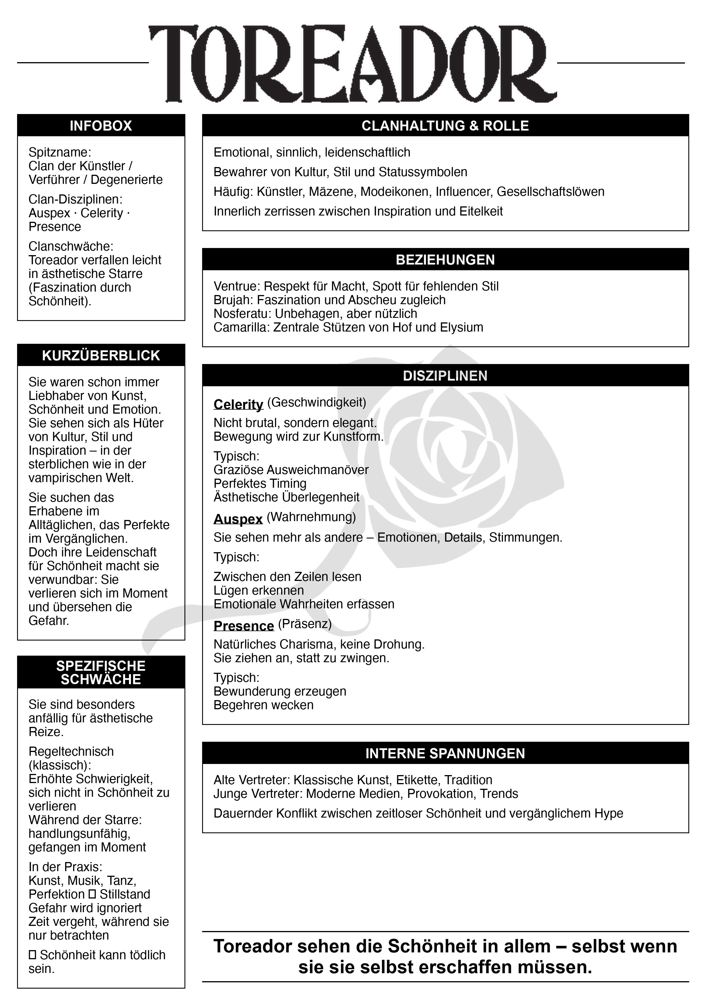

<a name="readme-top"></a>

<!-- Top Links Bar -->

[![LinkedIn][linkedin-shield]][linkedin-url]
[![Instagram][instagram-shield]][instagram-url]

<!-- PROJECT LOGO -->
<br />

<div align="center">
  <h1 align="center">Clan Sheet Generator</h1>

  <p align="center">
    Generate beautiful clan sheets for Vampire: The Masquerade (2nd/3rd edition)
    <br />
    <a href="https://github.com/foxnoir/pen_and_paper_generators"><strong>Explore the project »</strong></a>
    <br />
  </p>
</div>

<details>
  <summary>Table of Contents</summary>
  <ol>
    <li>
      <a href="#about-the-project">About The Project</a>
      <ul>
        <li><a href="#about-vampire-the-masquerade">About Vampire: The Masquerade</a></li>
      </ul>
    </li>
    <li>
      <a href="#features">Features</a>
    </li>
    <li>
      <a href="#installation">Installation</a>
      <ul>
        <li><a href="#requirements">Requirements</a></li>
        <li><a href="#setup">Setup</a></li>
      </ul>
    </li>
    <li>
      <a href="#usage">Usage</a>
      <ul>
        <li><a href="#quick-start">Quick Start</a></li>
        <li><a href="#interactive-mode">Interactive Mode</a></li>
        <li><a href="#file-structure">File Structure</a></li>
        <li><a href="#input-file-format">Input File Format</a></li>
        <li><a href="#clanessenz">CLANESSENZ</a></li>
      </ul>
    </li>
    <li>
      <a href="#examples">Examples</a>
    </li>
    <li>
      <a href="#file-links">File Links</a>
    </li>
    <li>
      <a href="#output">Output</a>
    </li>
    <li>
      <a href="#command-line-options">Command Line Options</a>
    </li>
    <li>
      <a href="#technical-details">Technical Details</a>
    </li>
    <li>
      <a href="#troubleshooting">Troubleshooting</a>
    </li>
    <li>
      <a href="#credits--attribution">Credits & Attribution</a>
    </li>
  </ol>
</details>

## About The Project

Clan Sheet Generator is a Python tool for generating beautiful clan sheets for **Vampire: The Masquerade** (2nd/3rd edition). Create professional-looking reference sheets for any clan with customizable content.

**Key Features:**
- Generate clan sheets for any Vampire: The Masquerade clan
- Professional layout with customizable sections
- Support for multiple clans (Brujah, Malkavianer, Toreador, etc.)
- Outputs both PNG and PDF formats
- High-resolution output (300 DPI)
- Customizable CLANESSENZ (clan essence/philosophy statement)

### About Vampire: The Masquerade

**Vampire: The Masquerade** is a tabletop role-playing game (RPG) set in a dark Gothic-Punk world where vampires struggle to maintain their humanity while navigating complex political structures. The game was originally published in 1991 and has seen multiple editions, with the 2nd and 3rd editions being particularly influential.

**Key Concepts:**
- **Clans**: Each vampire belongs to a clan, which determines their powers (Disciplines), weaknesses, and cultural background
- **The Masquerade**: The rule that vampires must hide their existence from mortals
- **Camarilla**: One of the major vampire sects, focused on maintaining the Masquerade
- **Disciplines**: Supernatural powers unique to each clan
- **Clan Weakness**: Each clan has a specific vulnerability or curse

<p align="right"><a href="#readme-top">back to top</a></p>

## Features

- Generate clan sheets for any Vampire: The Masquerade clan
- Professional layout with customizable sections
- Support for multiple clans (Brujah, Malkavianer, Toreador, etc.)
- Outputs both PNG and PDF formats
- High-resolution output (300 DPI)
- Customizable CLANESSENZ (clan essence/philosophy statement)

<p align="right"><a href="#readme-top">back to top</a></p>

## Installation

**Important:** If you're using a virtual environment (`.venv`), install the packages there!

### Requirements

- Python 3.7 or higher
- Pillow library (PIL)

### Setup

```bash
# Install dependencies
pip install -r requirements.txt

# Or in virtual environment:
.venv/bin/pip install -r requirements.txt
```

See [`requirements.txt`](requirements.txt) for the complete list of dependencies.

<p align="right"><a href="#readme-top">back to top</a></p>

## Usage

### Quick Start

The easiest way to generate a clan sheet is using the unified generator:

```bash
# Quick mode (uses default files)
python3 clan_sheet_gen.py --clan BRUJAH --quick

# Or specify files explicitly
python3 clan_sheet_gen.py --clan BRUJAH --input example_input.txt --clanessenz example_clanessenz.txt
```

### Interactive Mode

Enter text manually:

```bash
python3 clan_sheet_gen.py --clan BRUJAH --interactive
```

### File Structure

For each clan, you need two files:

1. **Input file** (`example_input.txt` or `{clan}_example_input.txt`): Contains all clan information sections
2. **CLANESSENZ file** (`example_clanessenz.txt` or `{clan}_clanessenz.txt`): Contains the clan's essence/philosophy statement

You can use generic filenames (`example_input.txt`, `example_clanessenz.txt`) or clan-specific ones. The generator will look for files matching the clan name first, then fall back to generic names.

### Input File Format

Your input file should contain sections with these headers (all uppercase):

- `{CLAN} INFOBOX` - Basic clan information (nickname, disciplines, weakness)
- `{CLAN} KURZÜBERBLICK` - Brief overview of the clan
- `{CLAN} SPEZIFISCHE SCHWÄCHE` - Detailed clan weakness explanation
- `{CLAN} DAS MALKAVIANER-NETZWERK` - (Malkavianer only) Network information
- `{CLAN} CLANHALTUNG & ROLLE` - Clan attitude and role
- `{CLAN} BEZIEHUNGEN` - Relationships with other clans
- `{CLAN} DISZIPLINEN` - Detailed discipline descriptions
- `{CLAN} INTERNE SPANNUNGEN` - Internal clan tensions

End your input with `ENDE` on a new line.

### CLANESSENZ

The CLANESSENZ is a short, powerful statement that captures the essence of the clan. It appears prominently on the generated sheet.

**Examples:**
- **Brujah**: "Brujah fühlen zuerst – und handeln dann. Wenn sie recht haben, brennt die Welt. Wenn nicht, auch."
- **Malkavianer**: "Sie lachen, wenn es nichts zu lachen gibt. Sie weinen, wenn andere noch schlafen. Und manchmal sagen sie die Wahrheit – zu früh."
- **Toreador**: "Toreador sehen die Schönheit in allem – selbst wenn sie sie selbst erschaffen müssen."

<p align="right"><a href="#readme-top">back to top</a></p>

## Examples

### Assets

The generator uses the following assets (located in the `clan_sheet_generator` directory):

<div align="center">
  <h3>Background Watermark</h3>
  
</div>

### Example Output

Here are some example clan sheets generated with this tool:

<div align="center">
  <h3>Malkavianer Clan Sheet</h3>
  
  
  <h3>Toreador Clan Sheet</h3>
  
</div>

### Example 1: Using Generic Files

**Input file** (`example_input.txt`):
```
BRUJAH INFOBOX

Spitzname:
Clan der Gelehrten / Rabauken / Rebellen

Clan-Disziplinen:
Celerity · Potence · Presence

Clanschwäche:
Brujah geraten leichter in Raserei (erhöhte Schwierigkeit, Frenzy zu widerstehen).

BRUJAH KURZÜBERBLICK

Die Brujah waren einst Philosophen, Denker und Idealisten.
Heute sind sie bekannt als Rebellen, Aufrührer und Hitzköpfe...

[... rest of content ...]

ENDE
```

**CLANESSENZ file** (`example_clanessenz.txt`):
```
Brujah fühlen zuerst – und handeln dann. Wenn sie recht haben, brennt die Welt. Wenn nicht, auch.
```

**Command:**
```bash
python3 clan_sheet_gen.py --clan BRUJAH --input example_input.txt --clanessenz example_clanessenz.txt
```

<p align="right"><a href="#readme-top">back to top</a></p>

## File Links

- [Example Input file](example_input.txt) - Template input file with all required sections
- [Example CLANESSENZ](example_clanessenz.txt) - Template CLANESSENZ file

<p align="right"><a href="#readme-top">back to top</a></p>

## Output

The generator creates two files:

- `{clan}_clan_sheet.png` - High-resolution PNG image (300 DPI)
- `{clan}_clan_sheet.pdf` - PDF version for printing

<p align="right"><a href="#readme-top">back to top</a></p>

## Command Line Options

```
--clan CLAN          Clan name (required, e.g., BRUJAH, MALKAVIANER)
--input FILE         Path to input text file (default: {clan}_example_input.txt or example_input.txt)
--clanessenz FILE    Path to CLANESSENZ file (default: {clan}_clanessenz.txt or example_clanessenz.txt)
--output-dir DIR     Output directory (default: current directory)
--quick              Quick mode: use default file names
--interactive        Interactive mode: enter text manually
```

<p align="right"><a href="#readme-top">back to top</a></p>

## Technical Details

- **Resolution**: 300 DPI (A4 format)
- **Format**: PNG and PDF output
- **Layout**: Two-column layout with customizable sections
- **Fonts**: System fonts (Helvetica/Arial) with fallbacks

<p align="right"><a href="#readme-top">back to top</a></p>

## Troubleshooting

### File Not Found Errors

Make sure your input and CLANESSENZ files are in the same directory as the script, or provide full paths using `--input` and `--clanessenz`.

### Missing Sections

If sections don't appear in the output, check that:
- Section headers are in ALL CAPS
- Headers match exactly (including clan name prefix)
- You've included `ENDE` at the end of your input

### Font Issues

The script tries to use system fonts. If you see font warnings, the script will fall back to default fonts. This shouldn't affect functionality.

<p align="right"><a href="#readme-top">back to top</a></p>

## Credits & Attribution

### Game Content

**Vampire: The Masquerade** is a trademark of White Wolf Entertainment AB. This project is not affiliated with or endorsed by White Wolf Entertainment AB or Paradox Interactive.

This tool is created for personal use and educational purposes by fans of the game. All game content, concepts, and terminology belong to White Wolf Entertainment AB.

### Assets

The following assets used in this generator are property of White Wolf Entertainment AB:
- **Logo** (`{clan_name}.png` or `clan_name.png` as fallback) - Copyright White Wolf Entertainment AB
- **Background Watermark** (`watermark.png`) - Copyright White Wolf Entertainment AB

These assets are used under fair use for fan-created content. If you are the copyright holder and wish to have these assets removed, please contact the repository maintainer.

### Software

The generator code itself is open source and available under the MIT License (see LICENSE file).

<p align="right"><a href="#readme-top">back to top</a></p>

[license-shield]: https://img.shields.io/github/license/othneildrew/Best-README-Template.svg?style=for-the-badge
[license-url]: https://github.com/othneildrew/Best-README-Template/blob/master/LICENSE.txt
[linkedin-shield]: https://img.shields.io/badge/-LinkedIn-black.svg?style=for-the-badge&logo=linkedin&colorB=555
[linkedin-url]: https://www.linkedin.com/in/tanja-polz-5636401a5/
[twitter-shield]: https://img.shields.io/badge/Twitter-%231DA1F2.svg?style=for-the-badge&logo=Twitter&logoColor=white
[twitter-url]: https://twitter.com/_foxnoir_?lang=de
[instagram-shield]: https://img.shields.io/badge/Instagram-%23E4405F.svg?style=for-the-badge&logo=Instagram&logoColor=white
[instagram-url]: https://www.instagram.com/codeincouture/
